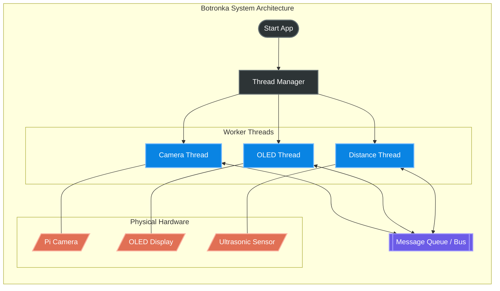

# Botronka Software Architecture diagram

The Botronka architecture is designed to be modular and easily extensible.

The core of the system is the `App` class, that contains the `ThreadManager` and the message queue system.
The individual threads are responsible for interacting with the hardware, and all events are sent to a message queue, and then redistributed to every thread. Each thread can choose to process or ignore the messages depending on their type and content.



The base components of a thread are illustrated by the `BaseThread` class:

```py
import threading
import queue


class BaseThread:
    def __init__(self, name: str, queue: queue.Queue[str]):
        #...

    def start(self):
        self.thread = threading.Thread(...)
        self.thread.start()

    def run(self) -> None:
        ...

    def handle_message(self, msg: str):
        ...

    def broadcast_message(self, msg: str):
        self.queue.put(msg)

    def stop(self):
        self.running = False
        ...
```

Whenever a message gets put into the queue, the `ThreadManager` is responsible for distributing it to all threads, by calling their `handle_message` method. Each thread can then choose to process or ignore the message depending on its type and content.