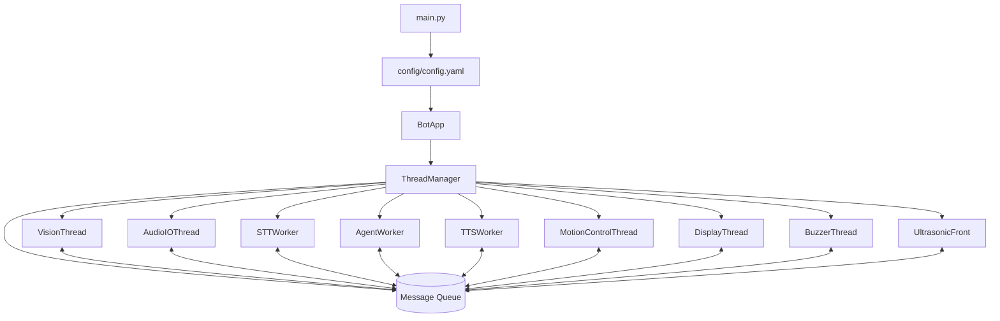
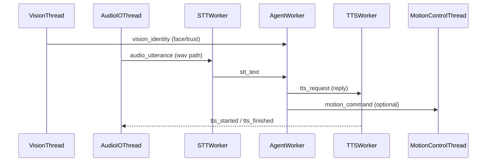
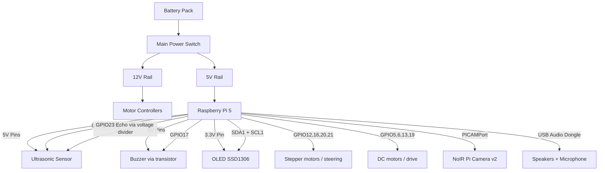
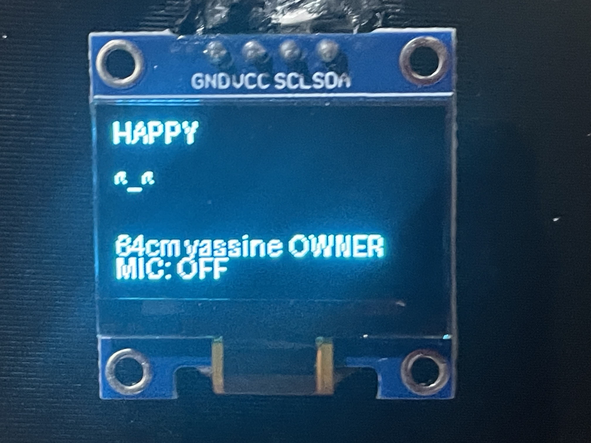
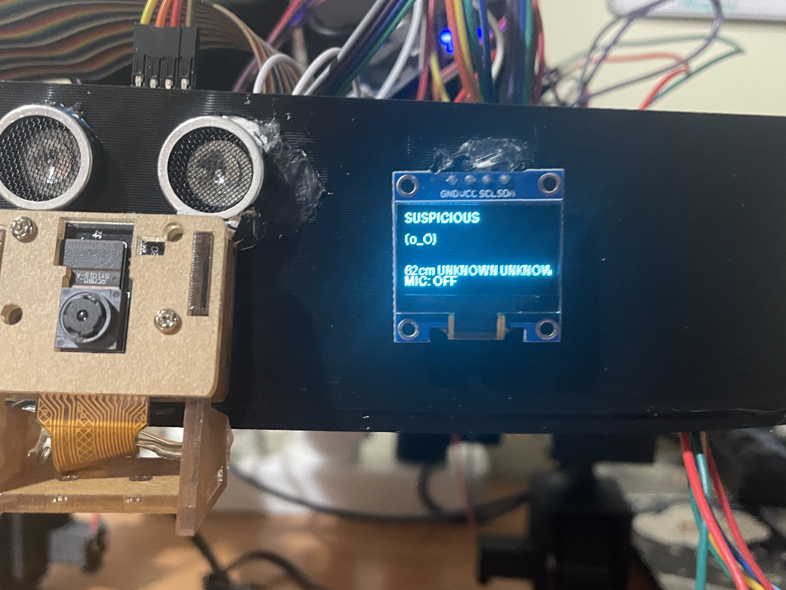

# Botronka — Social Companion AI Robot (Bot Ladybug)

Botronka is a modular Raspberry Pi robot project that combines **vision**, **audio**, **LLM-based dialogue**, and **motion control** into one event-driven application.  
It is built around a thread-based architecture where worker threads publish and consume messages over a shared queue.

---

## What this project does

- Detects and identifies faces from camera input
- Tracks trust levels for known/unknown people
- Allow Owner to register new people
- Records speech with VAD and transcribes it (STT)
- Uses an LLM to decide replies and actions
- Speaks responses with TTS
- Executes safe motion commands (trust-gated)
- Uses an Ultrasound sensor to track front distance
- Drives OLED and buzzer feedback

---

## Architecture overview

The app starts in `main.py`, loads `config/config.yaml`, creates `BotApp`, and starts all worker threads via `ThreadManager`.



### Runtime flow (voice + action path)



---

## Repository structure

```text
src/
  app.py                  # App wiring + thread startup
  core/                   # Message + shared runtime state
  threads/                # Worker threads
  vision/                 # Face recognition services/models
  audio/                  # VAD/STT/TTS wrappers
  agent/                  # NLU, policy, LLM client, admin actions

config/config.yaml        # Main runtime config
data/people/              # Face DB + trust map
tests/                    # Unit/integration/tools
logs/                     # Some testing logs
scripts/                  # Automation bash scripts
botronka-ThesisReport/    # Tex files for the thesis report

```

---

## Requirements

- Python **3.11+**
- Linux / Raspberry Pi OS (recommended for hardware features)
- Hardware dependencies depending on your setup:
  - Pi Camera
  - Ultrasonic sensor
  - OLED SSD1306 (I2C)
  - Buzzer
  - Wheel + stepper motor drivers
  - microphone + speakers

Python dependencies are defined in `pyproject.toml`.

---

## Setup

```bash
python -m venv .venv
source .venv/bin/activate
pip install --upgrade pip
pip install -e .
```

> If you run on Raspberry Pi and use hardware threads, make sure GPIO/I2C/camera interfaces are enabled.

---

## Configure

Main config file: `config/config.yaml`

Important sections:

- `autostart`: enables/disables boot launch behavior
- `vision`: camera + face recognition settings
- `audio_io`, `vad`, `stt`, `tts`: voice pipeline settings
- `agent`: prompts, trust policy, paths to people DB
- `motion`: pin mappings and motion behavior

### Model paths

By default, config points to local model files (for STT/TTS and vision).  
The repository ignores `models/` in git, so keep your model binaries locally.

---

## Run the application

```bash
source .venv/bin/activate
python main.py
```

Logs are printed to console (logging can be redirected to files if needed).

---

## Run automatically at boot (systemd)

This repository includes boot scripts/service files:

- `scripts/botfriend_boot.sh` (launcher)
- `scripts/botfriend.service` (systemd unit)
- `scripts/install_boot_service.sh` (installer)

Install and enable boot startup:

```bash
sudo bash scripts/install_boot_service.sh
```

Check status/logs:

```bash
systemctl status botfriend.service --no-pager
journalctl -u botfriend.service -f
```

Disable autostart without uninstalling service:

1. Edit `config/config.yaml`
2. Set:

```yaml
autostart:
  enabled: false
```

3. Restart service:

```bash
sudo systemctl restart botfriend.service
```

Re-enable by setting `autostart.enabled: true`.
To stop the program :
```bash
sudo systemctl stop botfriend.service
```
To fully disable service at system boot:
```bash
sudo systemctl disable --now botfriend.service
```

### Optional: auto-start local LLM server at boot

The boot launcher can start `llama-server` before `main.py`.
Configure under `autostart` in `config/config.yaml`:

```yaml
autostart:
  enabled: true
  start_llm_server: true
  llm_server_bin: /home/botronka/llama.cpp/build/bin/llama-server
  llm_model_path: /home/botronka/botfriend/models/llm/qwen2.5-0.5b-instruct-q4_k_m.gguf
  llm_host: 127.0.0.1
  llm_port: 8080
  llm_ctx_size: 1024
```

If `start_llm_server` is true, logs are written to:

- `logs/llama-server.log`

---

## Hardware GPIO / connection map

Connections based on my wiring.



### Pin summary

- OLED: `SDA1`, `SCL1`, `3.3V`, `GND`
- Buzzer: `GPIO17` (through transistor), `5V`, `GND`
- Ultrasonic: `GPIO24` (Trig), `GPIO23` (Echo via divider), `5V`, `GND`
- Stepper steering: `GPIO12`, `GPIO16`, `GPIO20`, `GPIO21`
- Drive DC motors: `GPIO5`, `GPIO6`, `GPIO13`, `GPIO19`


---

###  Run unit/integration tests

```bash
source .venv/bin/activate
python tests/unit/...
```

---

field test photo:

```md



```

---

## Notes

- Keep `data/people/face_db.json` and `data/people/trust_map.json` backed up if you register identities.
- `models/` and `data/captures/` are intentionally git-ignored to avoid pushing large/generated artifacts.
## Models used

- **STT**: `whisper.cpp` with **`ggml-small.en.bin`**
  - https://github.com/ggml-org/whisper.cpp
  - Model list/downloads: https://github.com/ggml-org/whisper.cpp/blob/master/models/README.md
- **LLM runtime**: `llama.cpp` server with **Qwen2.5-0.5B-Instruct (GGUF, Q4_K_M)**
  - https://github.com/ggml-org/llama.cpp
  - Qwen2.5 model family: https://huggingface.co/Qwen
- **TTS**: `piper` with **`en_US-lessac-medium.onnx`**
  - https://github.com/rhasspy/piper
- **Vision (face pipeline)**:
  - **YuNet** face detector (`face_detection_yunet.onnx`)
  - **SFace** face recognizer (`face_recognition_sface.onnx`)
  - OpenCV Zoo models: https://github.com/opencv/opencv_zoo

### Compared / considered

- **LLM candidate considered** : **Qwen2.5-1.5B-Instruct (Q4)** (higher latency on some prompts)

---

## License

Silesian University of Technology.
